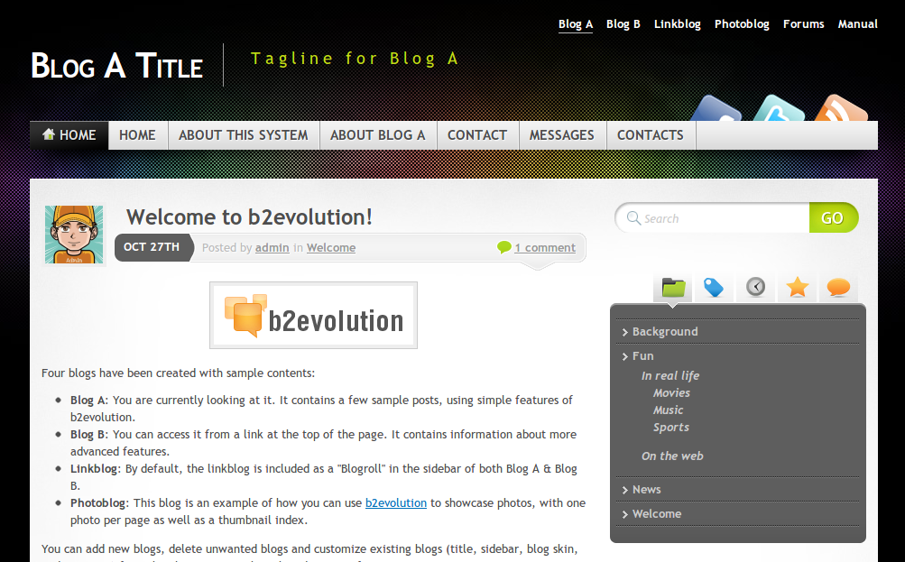
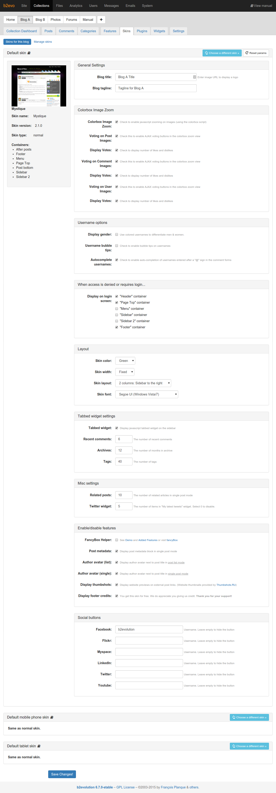
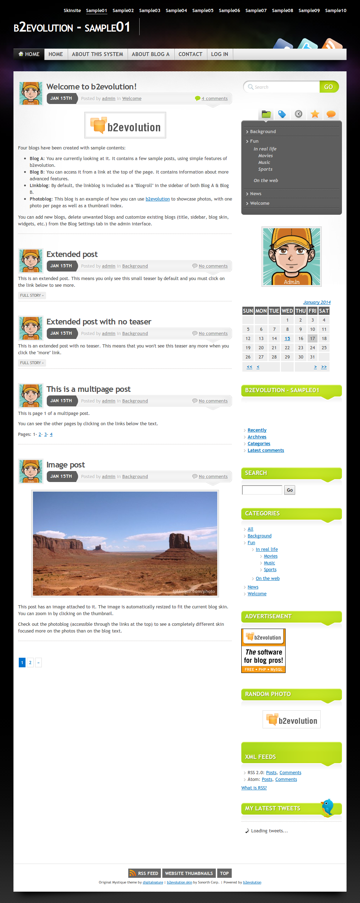
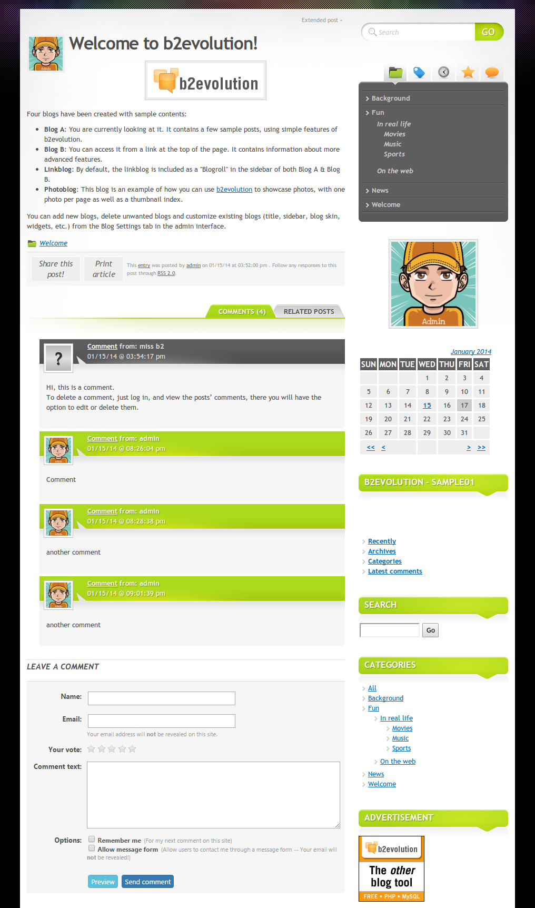

	Author: <a href="http://digitalnature.ro/">digitalnature</a>  
	Ported to b2evolution by <a href="http://www.sonorth.com/tech/">Sonorth Technologies</a> 
	Compatibility: b2evolution 3.x and up, including b2evolution v4, v5 and v6

<h3>Features:</h3>
<ul>
	<li>Width layout: fixed, fluid</li>
	<li>Columns: 1, 2 &amp; 3 column layouts</li>
	<li>Color schemes: green, blue, red, grey</li>
</ul>

<h4>v2.1.2</h4>
<ul>
	<li>Sitewide_header included for easier multibloging experience</li>
</ul>
<h4>v2.1.1</h4>
<ul>
	<li>Fixed compatibility issues with version 6.6+.</li>
</ul>
<h4>v2.1.0</h4>
<ul>
	<li>"Popular" tab removed from sidebar widget due to Item::$views is not available any more</li>
	<li>Fixed compatibility issues with version 6.5+.</li>
	<li>Public Github repository available to follow further development and support: <a href="https://github.com/b2evolution/mystique_skin">https://github.com/b2evolution/mystique_skin</a></li>
</ul>
<h4>v2.0.5</h4>
<ul>
	<li>Fixed jQuery Fancybox issue due to the "browser" property has been removed from jQuery</li>
</ul>
<h4>v2.0.4</h4>
<ul>
	<li>Fixed the broken built-in search box (reported in:  [[5-1-2-strange-behaviour]])</li>
	<li>Updated .pot file for translations</li>
</ul>
<h4>v2.0.3</h4>
<ul>
	<li>Support for Buttons and Thumbnails helpers feature of the Fancybox plugin</li>
</ul>
<h4>v2.0.2 (thanks to @achillis)</h4>
<ul>
	<li>
		
The related post link.

		
The related post link gives related links to posts only, so for page type posts it shows "No related Posts". It has been updated to display 'Related Posts' for item type [1] (Posts) and display 'Related Links' for item type [1000] (pages).

	</li>
	<li>FancyBox updated from version 1.2.1 (13/03/2009), to version: 2.1.5 (Fri, 14 Jun 2013)</li>
</ul>
<h4>v2.0.1</h4>
<ul>
	<li>Youtube icon in header</li>
</ul>
<h4>v2.0</h4>
<ul>
	<li>Added "My latest tweets" widget</li>
	<li>Post images open in Lightbox</li>
	<li>Added Facebook, Flickr, Myspace and LinkedIn buttons</li>
	<li>Display custom logo, blog title and tagline</li>
	<li>Control the number of comments, posts, archives and tags in Tabbed widget</li>
	<li>Control the number of Related posts</li>
	<li>Footer credits can be disabled</li>
	<li>Bugfixes</li>
</ul>
<h4>Since v1.0</h4>
<ul>
	<li>After posts &amp; Post bottom containers</li>
	<li><a href="http://forums.b2evolution.net/viewtopic.php?t=15593">Advanced Search</a> ready</li>
	<li>Social bookmarks</li>
	<li>Gravatars in comments</li>
	<li>Separate lists for comments and trackbacks</li>
	<li>Related posts list</li>
	<li>Website thumbnail previews</li>
	<li>Print stylesheet</li>
	<li>Fully translatable (Russian translation included)</li>
	<li>Lots of settings to play with :-)</li>
</ul>

 
This skin has been developed by a third party. It has been updated by the b2evolution group in an effort to make it work with the latest version of b2evolution. However, this skin is not officially supported by the b2evolution group.
